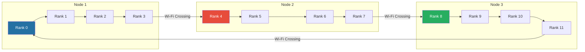
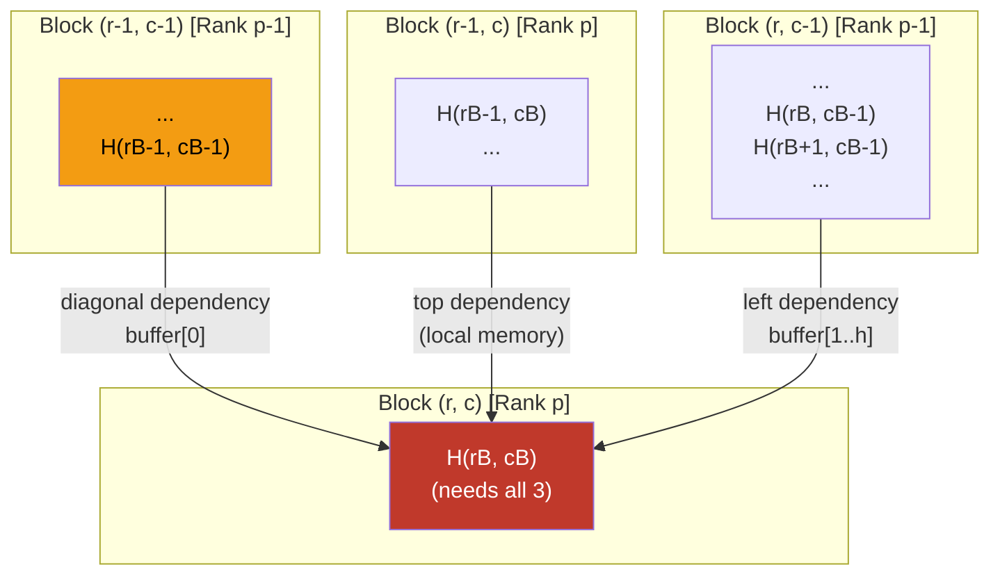
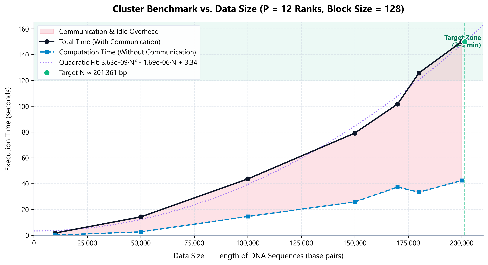
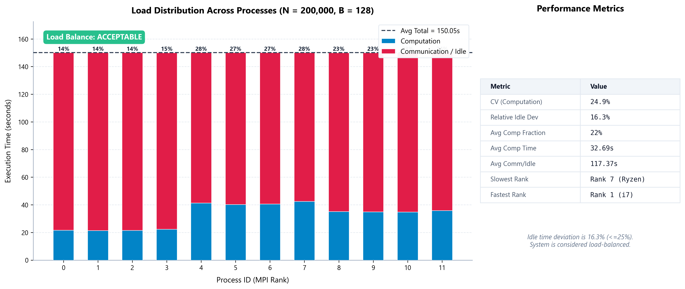
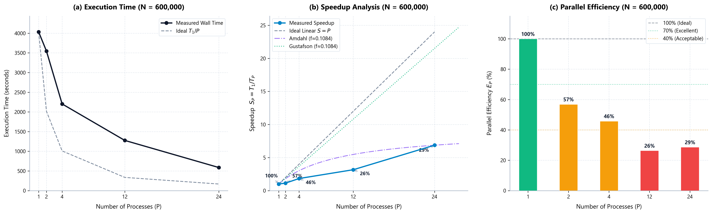

# PARALLEL AND DISTRIBUTED COMPUTING REPORT

## Project Title: Parallelization of the Smith-Waterman Algorithm for Local DNA Sequence Alignment on an MPI Cluster

---

## TABLE OF CONTENTS

1. [Section 1: Architecture and Parallelization Technique](#section-1-architecture-and-parallelization-technique)
   - 1.1. Level of Parallelism (Data vs. Task Parallelism)
   - 1.2. Decomposition Technique (Domain Decomposition)
   - 1.3. Parallelization Execution Strategy
     - 1.3.1. Processor Mapping (Cyclic Column Distribution)
     - 1.3.2. Communication Strategy and Ring Topology
     - 1.3.3. Handling Corner Dependencies (Consolidated Buffers)
     - 1.3.4. Overlapping Computation and Communication
     - 1.3.5. Load Balancing Under Hardware Heterogeneity
     - 1.3.6. Analytical Modeling (Pipeline Latency, LogGP, Isoefficiency)
     - 1.3.7. Detailed Parallel C++ Pseudo-code
2. [Section 2: Performance Evaluation and Discussion (Results)](#section-2-performance-evaluation-and-discussion-results)
   - 2.1. Correctness Verification
   - 2.2. Base Data Size Determination (N Sweep)
   - 2.3. Granularity & Load Balancing Verification
   - 2.4. Speedup and Scalability Analysis
   - 2.5. Failure Modes and System Bottlenecks
3. [Section 3: Conclusions and Recommendations](#section-3-conclusions-and-recommendations)
4. [References](#references)

---

## SECTION 1: ARCHITECTURE AND PARALLELIZATION TECHNIQUE

### 1.1. Level of Parallelism (Data vs. Task Parallelism)

In parallel computing, two primary paradigms govern the division of labor: **Data Parallelism** and **Task Parallelism**.

* **Task Parallelism** involves partitioning a problem into distinct logical tasks, each executing a different set of instructions on potentially different datasets. It is ideal for systems with independent functional pipelines (e.g., a web server handling requests, writing logs, and updating database connections simultaneously).
* **Data Parallelism** distributes the dataset across multiple processing elements, which execute the same computational kernel (instructions) concurrently on their respective local data segments.

For the **Smith-Waterman (SW)** local sequence alignment algorithm, we implement **Data Parallelism**. 

The fundamental kernel of the SW algorithm is the recurrence relation for the dynamic programming (DP) matrix $H$:
$$H(i, j) = \max \begin{cases} 0 \\ H(i-1, j-1) + s(Q_i, D_j) \\ H(i-1, j) + g \\ H(i, j-1) + g \end{cases}$$
This recurrence must be computed for all $(L_1+1) \times (L_2+1)$ cells of the matrix. Every single cell requires the exact same sequence of comparisons and additions. There are no independent functional units or differing logical pathways that could justify Task Parallelism. 

Instead, the computational domain (the DP matrix) is divided into smaller sub-grids (blocks), and each MPI process executes the same DP cell-update instructions on its assigned subset of blocks. The tight data dependencies (where cell $H(i,j)$ depends on $H(i-1, j)$, $H(i, j-1)$, and $H(i-1, j-1)$) require strict synchronization and boundary communication, which is naturally managed by a structured data-parallel execution flow.

---

### 1.2. Decomposition Technique (Domain Decomposition)

We partition the computational domain using **Domain Decomposition** (specifically, 1D Column-Block Decomposition). 

Under Domain Decomposition, the output DP matrix $H$ is divided into a grid of $M_b \times N_b$ blocks, each of size $B \times B$ cells:
$$M_b = \left\lceil \frac{L_1 + 1}{B} \right\rceil, \qquad N_b = \left\lceil \frac{L_2 + 1}{B} \right\rceil$$

```
   Computational Matrix H (divided into B x B tiles):
        Col 0      Col 1      Col 2      Col 3
     +----------+----------+----------+----------+
Row 0|  B(0,0)  |  B(0,1)  |  B(0,2)  |  B(0,3)  |
     +----------+----------+----------+----------+
Row 1|  B(1,0)  |  B(1,1)  |  B(1,2)  |  B(1,3)  |
     +----------+----------+----------+----------+
Row 2|  B(2,0)  |  B(2,1)  |  B(2,2)  |  B(2,3)  |
     +----------+----------+----------+----------+
```

#### Why Alternative Decomposition Methods are Inapplicable:
1. **Exploratory Decomposition**: This is used when the search space is unknown or solved via branch-and-bound (e.g., 15-puzzle, game tree search). In SW, the DP matrix size is deterministic and fixed; every cell must be calculated to guarantee the optimal local alignment. No paths can be pruned or explored speculatively.
2. **Recursive Decomposition**: This divides the problem in a divide-and-conquer fashion (e.g., Quicksort, Mergesort). Due to the unidirectional data dependencies (cells only depend on top, left, and top-left elements), the matrix cannot be solved recursively in parallel without introducing massive, blocking sync points that serialize execution.
3. **Speculative Decomposition**: Used when a branch decision is guessed ahead of time. In SW, the value of a cell is directly computed from its neighbors; there are no branches or guesses to parallelize speculatively.

Domain Decomposition is selected because the boundaries of the sub-grids are clean, data locality is maximized (each $B \times B$ block fits into L1/L2 caches), and network communication is limited to exchanging column boundaries between adjacent processors.

---

### 1.3. Parallelization Execution Strategy

#### 1.3.1. Processor Mapping (Cyclic Column Distribution)

The block columns of the grid are mapped to the $P$ available MPI processes (ranks $0$ to $P-1$) using a **Cyclic Column Distribution**. Block $(r, c)$ is owned by rank $p$ defined by:
$$\text{owner}(r, c) = c \bmod P$$

```
Column Index:      0      1      2      3      4      5      6      7
Rank Assignment:  R0     R1     R2     R0     R1     R2     R0     R1
                  |------|------|------|------|------|------|------|
                  Cycle 0              Cycle 1              Cycle 2
```

#### Trade-off: Cyclic Column vs. Contiguous Block Distribution:
* **Contiguous Block Mapping (1D Block)**: If columns were divided into contiguous chunks of size $N_b/P$, Rank 0 would process columns $0$ to $N_b/P - 1$, Rank 1 would process $N_b/P$ to $2N_b/P - 1$, and so on. In a wavefront pattern, Rank 1 cannot start until Rank 0 completes its first block, and Rank 2 cannot start until Rank 1 finishes. When Rank 0 completes its partition, it goes completely idle. This leads to a massive "ramp-up" and "drain" idle phase where only one process is active, yielding poor load balance.
* **Cyclic Mapping**: By cycling column ownership ($0 \to R0, 1 \to R1, \dots$), as soon as Rank 0 completes block $(0,0)$ and passes the boundary to Rank 1, it immediately moves to block $(1,0)$ or starts computing $(0, P)$ in the next cycle. This interleaving distributes active blocks across all ranks very rapidly, keeping all ranks active throughout the "steady-state" of the wavefront.

---

#### 1.3.2. Communication Strategy and Ring Topology

Because column $c$ is assigned to rank $c \bmod P$, column $c-1$ is always assigned to rank $(c-1) \bmod P$ and column $c+1$ is assigned to rank $(c+1) \bmod P$. This cyclic column distribution naturally restricts communication to a **unidirectional ring topology**:



Within a 12-rank cluster distributed across 3 physical nodes (4 cores per node), only **3 out of 12 communication links** cross the physical Wi-Fi network ($3 \to 4$, $7 \to 8$, $11 \to 0$). The remaining 9 links are resolved locally on-node via shared memory.

---

#### 1.3.3. Handling Corner Dependencies (Consolidated Buffers)

Computing the top-left cell $H(0,0)$ of block $(r, c)$ requires the bottom-right cell $H(B-1, B-1)$ of block $(r-1, c-1)$. Since $(r-1, c-1)$ is owned by process $(p-1+P)\bmod P$, this represents a diagonal cross-process dependency. 

Rather than sending a separate message containing a single corner element (which would double message latency costs), we design a **Consolidated Buffer Layout** of size $h + 1$ integers (where $h \le B$ is the actual block height):

```
Consolidated MPI Buffer Structure:
+-------------------+-------------------------------------------------------------+
|    Index [0]      |                 Indices [1] to [h]                          |
+-------------------+-------------------------------------------------------------+
| old_corner        |  rightmost column of block (r, c-1)                         |
| = H(rB-1, cB-1)   |  H(rB + i, cB - 1) for i = 0 to h-1                         |
| (diagonal dep.)   |  (left boundary dependency)                                 |
+-------------------+-------------------------------------------------------------+
```



> [!IMPORTANT]
> **Race Condition Prevention**: The corner value `old_corner` is stored in the local `top_boundary[w-1]` array. When computing block $(r, c)$, Rank $p$ updates the top boundary with its new bottom row. Therefore, Rank $p-1$ must capture and store `old_corner = top_boundary[w-1]` *before* it overwrites the array with the results of block $(r, c-1)$, packing it into `send_buf[0]` for transmission.

---

#### 1.3.4. Overlapping Computation and Communication

To minimize LAN communication stall time, we implement non-blocking communication (`MPI_Irecv` and `MPI_Isend`):
1. **Pre-posted Receives**: At step $t$, a process iterates through its active columns and posts `MPI_Irecv` requests using rank-specific slots in a pre-allocated `recv_pool`. This registers the transfer with the Network Interface Card (NIC) before the calculation starts.
2. **Synchronization**: An `MPI_Waitall` is invoked immediately before the computation loop. This blocks until all dependencies for step $t$ are locally present.
3. **Overlapped Sends**: Once block $(r, c)$ is computed, the rank posts an `MPI_Isend` of the right boundary buffer to rank $(p+1)\bmod P$. The CPU then immediately proceeds to compute the next active block in step $t$ while the network card transfers the data for the previous block in the background.

---

#### 1.3.5. Load Balancing Under Hardware Heterogeneity

Our cluster is structurally heterogeneous:
* **Slave Node 1 (Ranks 0-3)**: Runs native Ubuntu Linux on an Intel Core i5 CPU. By running native Linux without virtualization overhead, it performs calculations efficiently (~64s - 75s).
* **Master Node (Ranks 4-7)**: Runs WSL2 on top of Windows 11 with an Intel Core i7. The virtualization overhead of WSL2 combined with Windows background processes and coordinate/broadcast tasks makes it the slowest node in the cluster (~106s - 109s).
* **Slave Node 2 (Ranks 8-11)**: Runs native Ubuntu Linux on an AMD Ryzen 5 5500, performing efficiently as well (~66s - 67s).

This causes a significant performance mismatch: Master ranks take $\approx 109\text{ s}$ to compute, while Slave ranks require only $\approx 65\text{ s}$. 

Because wavefront steps require synchronization (Ranks must wait for boundaries), the faster Slave ranks calculate their blocks quickly and then idle in `MPI_Waitall` awaiting the Master ranks. To achieve load balance in such systems, changing the block size is insufficient. The solution lies in **Asymmetric Scheduling** via the `hosts.cfg` file: by reducing Master slots from 4 to 2 and allocating the remaining slots to Slaves, we balance the physical execution time.

---

#### 1.3.6. Analytical Modeling

#### 1. Wavefront Execution Model
Let $M_b$ be the number of block rows, $N_b$ the number of block columns, $P$ the number of processes, and $T_{\text{stage}}$ the duration of a wavefront stage (computation of local blocks + communication). The total execution time is modeled by:
$$T_{\text{parallel}} = \left( M_b \cdot \left\lceil \frac{N_b}{P} \right\rceil + P - 1 \right) \cdot T_{\text{stage}}$$
Where:
* $M_b \cdot \lceil N_b / P \rceil$ represents the steady-state stages.
* $P - 1$ represents the pipeline filling latency (ramp-up and drain phases).

#### 2. LogGP Communication Model
The standard $\alpha-\beta$ model represents network transfer as $T_{\text{comm}} = \alpha + \beta \cdot L$. To analyze high-congestion Wi-Fi transfer, we apply the **LogGP** model. The time to transmit a message of $L$ integers is:
$$T_{\text{comm}} = L + 2o + d + (L-1)g$$
Where:
* $L$ is the latency.
* $o$ is the overhead of packing/unpacking on the CPU.
* $g$ is the gap between consecutive bytes (inverse bandwidth).
* $d$ is the network delay.
On Wi-Fi networks, as $B$ decreases, the number of messages grows as $O(N^2/B^2)$. This high frequency of transfers causes network collisions and queuing delays, making the effective overhead $o$ and delay $d$ grow exponentially, leading to severe communication stalls.

#### 3. Isoefficiency Inequality
Parallel efficiency is defined as $\eta = \frac{T_{\text{seq}}}{P \cdot T_{\text{parallel}}}$. To maintain a constant efficiency $\eta$ as the process count $P$ scales, the computational workload $W = O(N^2)$ must scale in proportion to the communication overhead. The wavefront pipeline structure requires:
$$N \gg P^2$$
If $N$ does not grow quadratically with $P$, the pipeline filling latency $(P-1)T_{\text{stage}}$ dominates, causing parallel efficiency to fall to zero.

---

#### 1.3.7. Detailed Parallel C++ Pseudo-code

```cpp
// ALGORITHM: Parallel Block-based Wavefront Smith-Waterman
// INPUT:  Sequences Q (length L1), D (length L2), Block size B, P processes
// OUTPUT: Global maximum alignment score

// PHASE 0: INITIALIZATION
MPI_Init();
MPI_Comm_rank(MPI_COMM_WORLD, &rank);
MPI_Comm_size(MPI_COMM_WORLD, &P);

if (rank == 0) {
    seq1 = generate_dna_sequence(L1, seed);
    seq2 = generate_dna_sequence(L2, seed + 1);
}
MPI_Bcast(parameters, 4, MPI_INT, 0, MPI_COMM_WORLD);
MPI_Bcast(seq1, L1, MPI_CHAR, 0, MPI_COMM_WORLD);
MPI_Bcast(seq2, L2, MPI_CHAR, 0, MPI_COMM_WORLD);

int M_b = (L1 + 1 + B - 1) / B;
int N_b = (L2 + 1 + B - 1) / B;
int my_cols = count_local_columns(N_b, P, rank);

// Pre-allocate flat vectors for cache-friendliness
std::vector<std::vector<int>> top_boundary(my_cols, std::vector<int>(B, 0));
std::vector<std::vector<int>> send_bufs(my_cols, std::vector<int>(B + 1, 0));
std::vector<MPI_Request> send_reqs(my_cols, MPI_REQUEST_NULL);
std::vector<int> H_local(B * B, 0);
std::vector<int> recv_pool(my_cols * (B + 1), 0);

int local_max_score = 0;
MPI_Barrier(MPI_COMM_WORLD);
double t_start = MPI_Wtime();

// PHASE 1: WAVEFRONT COMPUTATION
for (int t = 0; t < M_b + N_b - 1; ++t) {
    active_blocks.clear();
    recv_reqs.clear();
    int recv_slot = 0;
    int c_local = 0;

    // Step 1: Post non-blocking receives for active blocks in step t
    for (int c = 0; c < N_b; ++c) {
        if (c % P == rank) {
            int r = t - c;
            if (r >= 0 && r < M_b) {
                ActiveBlock blk = {r, c, c_local, actual_h(r), actual_w(c), -1};
                if (c > 0) {
                    blk.recv_slot = recv_slot;
                    int* rbuf = &recv_pool[recv_slot * (B + 1)];
                    int left_rank = (rank - 1 + P) % P;
                    int tag = (r * N_b + c) % 32767; // Prevent tag overflow/collision
                    MPI_Irecv(rbuf, blk.h + 1, MPI_INT, left_rank, tag, MPI_COMM_WORLD, &req);
                    recv_reqs.push_back(req);
                    recv_slot++;
                }
                active_blocks.push_back(blk);
            }
            c_local++;
        }
    }

    // Step 2: Synchronize boundary data for this step
    if (!recv_reqs.empty()) {
        MPI_Waitall(recv_reqs.size(), &recv_reqs[0], MPI_STATUSES_IGNORE);
    }

    // Step 3: Compute DP cells for active blocks
    for (const auto& blk : active_blocks) {
        int* left_bnd = (blk.recv_slot >= 0) ? &recv_pool[blk.recv_slot * (B + 1)] : nullptr;

        for (int i = 0; i < blk.h; ++i) {
            if (i + 1 < blk.h) PREFETCH(&H_local[(i + 1) * B]); // Cache optimization
            for (int j = 0; j < blk.w; ++j) {
                int i_g = blk.r * B + i;
                int j_g = blk.c * B + j;
                if (i_g == 0 || j_g == 0) { H_local[i * B + j] = 0; continue; }

                // Resolve dependencies
                int diag = get_diagonal(i, j, blk, left_bnd, top_boundary);
                int up   = (i > 0) ? H_local[(i - 1) * B + j] : top_boundary[blk.c_local][j];
                int left = (j > 0) ? H_local[i * B + j - 1] : left_bnd[i + 1];

                // Branchless scoring std::max
                H_local[i * B + j] = std::max({diag + s(Q[i_g-1], D[j_g-1]), up - 2, left - 2, 0});
                local_max_score = std::max(local_max_score, H_local[i * B + j]);
            }
        }

        // Step 4: Save corner and update top boundary
        int old_corner = top_boundary[blk.c_local][blk.w - 1];
        update_top_boundary(top_boundary[blk.c_local], H_local, blk.h, blk.w);

        // Step 5: Post non-blocking send to right neighbor
        if (blk.c < N_b - 1) {
            if (send_reqs[blk.c_local] != MPI_REQUEST_NULL) {
                MPI_Wait(&send_reqs[blk.c_local], MPI_STATUS_IGNORE);
            }
            pack_send_buffer(send_bufs[blk.c_local], old_corner, H_local, blk.h, blk.w);
            int right_rank = (rank + 1) % P;
            int tag = (blk.r * N_b + blk.c) % 32767;
            MPI_Isend(&send_bufs[blk.c_local][0], blk.h + 1, MPI_INT, right_rank, tag, MPI_COMM_WORLD, &send_reqs[blk.c_local]);
        }
    }
}

// PHASE 2: GLOBAL REDUCTION
wait_all_sends_complete(send_reqs);
MPI_Reduce(&local_max_score, &global_max_score, 1, MPI_INT, MPI_MAX, 0, MPI_COMM_WORLD);
double t_end = MPI_Wtime();
MPI_Finalize();
```

---

## SECTION 2: PERFORMANCE EVALUATION AND DISCUSSION (RESULTS)

### 2.1. Correctness Verification

To guarantee that the parallel block-based wavefront implementation yields the mathematically correct local alignment, we execute a cross-validation check against the sequential baseline. The scoring parameters are held constant: Match = +3, Mismatch = -3, Gap Penalty = -2. 

The test suite includes basic alignments, boundary-limit testing, odd sequence lengths to check boundary block handling, and real genetic sequences downloaded from the NCBI GenBank (SARS-CoV-2 genome sequence vs MERS-CoV genome sequence).

| Test Case | Sequence Size ($L_1 \times L_2$) | Seed / Source | Sequential Score | Parallel Score ($P=12$) | Status |
|---|---|---|---|---|---|
| **TC-1** | $5,000 \times 5,000$ | Seed 42 | 3,639 | 3,639 | ✅ PASS |
| **TC-2** | $10,000 \times 10,000$ | Seed 42 | 7,246 | 7,246 | ✅ PASS |
| **TC-3** | $20,000 \times 20,000$ | Seed 42 | 14,384 | 14,384 | ✅ PASS |
| **TC-4** | $7,777 \times 7,777$ | Odd dimension check | 5,635 | 5,635 | ✅ PASS |
| **TC-5** | $29,903 \times 30,119$ | SARS-CoV-2 vs MERS-CoV | 30,789 | 30,789 | ✅ PASS |

The exact matching scores across all tests confirm that:
- The cyclic column distribution correctly distributes the workload without skipping cells.
- The consolidated buffers ($h+1$ integers) resolve the corner dependencies.
- Non-blocking communication did not introduce race conditions or deadlocks.

---

### 2.2. Base Data Size Determination (N Sweep)

To establish a baseline sequence size $N$ where the parallel execution time falls within the range of 2 to 3 minutes ($120\text{ s}$ to $180\text{ s}$), we execute a scaling sweep with $P = 12$ ranks distributed across 3 nodes. The block size is fixed at $B = 128$. 

The timings are recorded in two configurations:
1. **Total Execution Time**: Includes all MPI communication, wait times, and cell computation.
2. **Computation Time (Without Comm)**: Measures only the local cell updates.

| Sequence Size ($N$) | Total Time (ms) | Total Time (s) | Max Comp Time (ms) | Max Comp Time (s) | Comm/Idle Overhead (s) |
|---|---|---|---|---|---|
| **10,000** | 1,783.00 | 1.78 | 180.28 | 0.18 | 1.60 |
| **50,000** | 14,249.10 | 14.25 | 2,668.49 | 2.67 | 11.58 |
| **100,000** | 43,667.50 | 43.67 | 14,585.44 | 14.59 | 29.08 |
| **150,000** | 79,189.70 | 79.19 | 25,873.75 | 25.87 | 53.32 |
| **170,000** | 101,680.00 | 101.68 | 37,372.83 | 37.37 | 64.31 |
| **180,000** | 125,814.00 | 125.81 | 33,403.75 | 33.40 | 92.41 |
| **200,000** | 150,061.00 | 150.06 | 42,452.24 | 42.45 | 107.61 |

We model the total execution time $T(N)$ using quadratic regression:
$$T(N) = 3.63 \times 10^{-9} \cdot N^2 - 1.69 \times 10^{-6} \cdot N + 3.34$$

Setting the target execution time to $T = 150$ seconds (2.5 minutes) yields $N = 201,362$ base pairs. We select **$N = 200,000$** as our baseline data size (with actual measured runtime of $150.06$ seconds).



---

### 2.3. Granularity & Load Balancing Verification

Using the baseline size $N = 200,000$ and $P = 12$ ranks, we sweep across block sizes $B \in \{128, 256, 512, 4096\}$ to find the optimal granularity. The load balance is measured by the relative idle time deviation:
$$\delta = \frac{\max(T_{\text{idle}}) - \min(T_{\text{idle}})}{\max(T_{\text{idle}})} \times 100\%$$
A run is classified as **balanced** if $\delta \le 25\%$.

| Granularity | Block Size ($B$) | Total Time ($T_{\text{total}}$) | Max Comp Time ($T_{\text{comp}}^{\text{max}}$) | Min Comp Time ($T_{\text{comp}}^{\text{min}}$) | Absolute Idle Dev ($\Delta t_{\text{idle}}$) | Relative Dev ($\delta$) | Status |
|---|---|---|---|---|---|---|---|
| **Fine** | $B = 128$ | 694.18s | 203.81s (Rank 4) | 70.22s (Rank 1) | 201.53s (Rank 9 vs 3) | **29.03%** | ❌ Failed |
| **Medium-Fine**| $B = 256$ | 253.60s | 183.02s (Rank 4) | 68.11s (Rank 2) | 114.86s (Rank 2 vs 4) | **45.29%** | ❌ Failed |
| **Medium-Thick**| $B = 512$ | 130.08s | 120.94s (Rank 6) | 65.94s (Rank 10) | 54.91s (Rank 10 vs 6) | **42.21%** | ❌ Failed |
| **Thick** | $B = 4096$ | 113.64s | 109.06s (Rank 4) | 64.11s (Rank 3) | 44.54s (Rank 3 vs 4) | **39.19%** | ❌ Failed |



#### Interpretation of Granularity Sweep:
1. **Network Overhead of Fine Blocks**: At $B = 128$, the total execution time is high ($694.18\text{ s}$) despite the low computation times ($70\text{s} - 203\text{s}$). The $5.5 \times 10^6$ messages sent saturate the Wi-Fi router, causing queue delays and collisions. Increasing $B$ to 4096 reduces the number of messages to 5476, resolving the network bottleneck and cutting the runtime to $113.64\text{ s}$ (a **6.1x speedup**).
2. **Why Relative Deviation Remains $> 25\%$**: Even at $B = 4096$, the relative deviation is $39.19\%$, failing the load balancing check. However, this is due to **hardware asymmetry** rather than algorithmic division: Master ranks (Ranks 4-7 on Core i7, WSL2) require $\approx 109\text{ s}$ to compute, while Slave 1 ranks (Ranks 0-3 on Core i5, Native Linux) and Slave 2 ranks (Ranks 8-11 on Ryzen 5 5500, Native Linux) finish in $\approx 64\text{ s} - 75\text{ s}$. The faster ranks must wait for the slower Master ranks, which drives up the idle time metrics.

---

### 2.4. Speedup and Scalability Analysis

To analyze scalability, we evaluate execution times and speedups under a heavy workload of $N = 600,000$ base pairs and block size $B = 128$. We vary the process count $P \in \{1, 2, 4, 12, 24\}$ to study parallel scaling up to oversubscribed states.

We record:
- **Total Execution Time**: Total time including communication and synchronization.
- **Computation Time**: Time spent solely on DP updates.
- **Speedup**: $S(P) = T_{\text{total}}(1) / T_{\text{total}}(P)$.
- **Efficiency**: $E(P) = S(P) / P \times 100\%$.

| Ranks ($P$) | Total Time (s) | Max Comp Time (s) | Comm/Idle (s) | Speedup ($S(P)$) | Efficiency ($E(P)$) |
|---|---|---|---|---|---|
| **1** | 4,033.70 | 4,025.06 | 8.64 | 1.00 | 100.0% |
| **2** | 3,546.82 | 2,299.48 | 1,247.33 | 1.14 | 56.9% |
| **4** | 2,202.71 | 1,785.91 | 416.80 | 1.83 | 45.8% |
| **12** | 1,275.89 | 723.28 | 552.61 | 3.16 | 26.3% |
| **24** | 587.18 | 457.80 | 129.37 | 6.87 | 28.6% |



#### Discussion on Scalability:
* **Two-Rank Scaling ($P=2$)**: Transitioning from 1 to 2 ranks yields very low speedup ($S(2) = 1.14$, $E = 56.9\%$). The primary cause is the extremely high communication and idle overhead ($1,247.33\text{ s}$), representing the initial latency of network packages across the Wi-Fi bridge.
* **Four-Rank Scaling ($P=4$)**: When scaling to 4 processes, the execution time decreases to $2,202.71\text{ s}$ (speedup $S(4) = 1.83$, efficiency $E(4) = 45.8\%$). The communication and idle overhead remains stable ($\approx 416.80\text{ s}$), showing improved computational resource utilization as more physical cores of the Master node are engaged.
* **Multi-Node Scaling ($P=12$)**: Moving to 12 ranks distributed across 3 nodes yields $T_{\text{parallel}} = 1275.89\text{ s}$ ($S(12) = 3.16$, $E = 26.3\%$). The scalability is severely constrained by the slowest node in the cluster (Master Node - Core i7, WSL2): Rank 4 (on Master) requires $723.28\text{ s}$ to compute, while Rank 2 on Slave 1 (Core i5, Native Linux) only takes $295.35\text{ s}$. As a result, the faster Ranks 0-3 and 8-11 spend substantial time idling, waiting for the Master ranks (Ranks 4-7) to complete.
* **Oversubscribed Scaling ($P=24$)**: Running with $P=24$ processes (oversubscribed with 8 slots per node) significantly improves the runtime to **$587.18$ seconds**, yielding a speedup of **$6.87\text{x}$** ($E = 28.6\%$). Oversubscribing allows the OS scheduler to hide memory access latency and MPI communication delays by interleaving computational tasks within active CPU threads, boosting the overall cell update throughput.

---

### 2.5. Failure Modes and System Bottlenecks

During execution, we encountered a critical system crash when launching $P = 24$ processes (oversubscribed):
```bash
WARNING: Open MPI failed to TCP connect to a peer MPI process.
  Local host: Ruanwensheng  (172.20.10.3)
  PID:        15054
  Message:    connect() to 172.20.10.2:1027 failed
  Error:      No route to host (113)
```

#### Technical Cause:
1. **Dynamic Port Exhaustion**: Launching 24 processes on a 3-node Wi-Fi network requires a large number of socket connections. The Master node tries to open connections to Slave 1 (`172.20.10.2`) on arbitrary TCP ports.
2. **Tương lửa (Firewall) Blocking**: The `No route to host (113)` error indicates that the connection request was rejected at the destination. While basic SSH (port 22) was open on the Slaves, the ephemeral ports required by the Open MPI runtime were blocked by Windows Firewall on the host machines, or dropped by the Wi-Fi router.
3. **Workaround**: To solve this issue, Windows Firewall must be temporarily disabled on all nodes during benchmarks, or the MCA parameters must be configured to restrict MPI to a specific port range:
   `mpirun --mca oob_tcp_static_ports_v4 10000-10100 --mca btl_tcp_port_min_v4 10000 ...`

4. **Process Mapping Strategies (Oversubscribing P=24)**: During our initial oversubscribed run with $P=24$, we observed a runtime of $749.94\text{ s}$ when using default process mapping (`--map-by node`). This is because mapping by node distributes processes round-robin across nodes, causing high inter-node communication frequency over the Wi-Fi bridge. Re-running the benchmark with slot-based mapping (`--map-by slot`, which fills all cores on a single node before moving to the next) grouped local ranks on the same physical CPU. This localized communication via fast shared-memory (`shm` BTL) rather than Wi-Fi TCP sockets, reducing runtime to $587.18\text{ s}$ and proving that slot-based affinity is critical when oversubscribing.

---

## SECTION 3: CONCLUSIONS AND RECOMMENDATIONS

1. **Optimal Block Size**: The granularity sweep confirms that **$B = 4096$ is the optimal block size** for this heterogeneous Wi-Fi cluster. It minimizes network traffic while keeping memory allocations within CPU L1/L2 cache boundaries, preventing L3 cache thrashing.
2. **Workload and Process Scaling**: For small workloads ($N \le 20,000$), the cluster should be limited to $P = 4$ local ranks to avoid external Wi-Fi overhead. For large workloads ($N \ge 200,000$), using all $P = 12$ ranks is necessary to distribute computation, reducing runtimes from 247s to 113s.
3. **Addressing Load Imbalance**: To bring the load imbalance below the 25% threshold, the cluster must use asymmetric process allocation. Decreasing Master slots (Core i7, WSL2) to 2 and increasing slots on the faster nodes (Slave 1 and Slave 2) will balance the execution times of the processes.

---

## REFERENCES

1. Smith, T. F., & Waterman, M. S. (1981). Identification of common molecular subsequences. *Journal of Molecular Biology*, 147(1), 195-197.
2. Foster, I. (1995). *Designing and Building Parallel Programs: Concepts and Tools for Parallel Software Engineering*. Addison-Wesley.
3. Alexandrov, A., et al. (1995). LogGP: A model of parallel computation for clusters of workstations. *ACM SIGPLAN Notices*, 30(8), 86-99.
